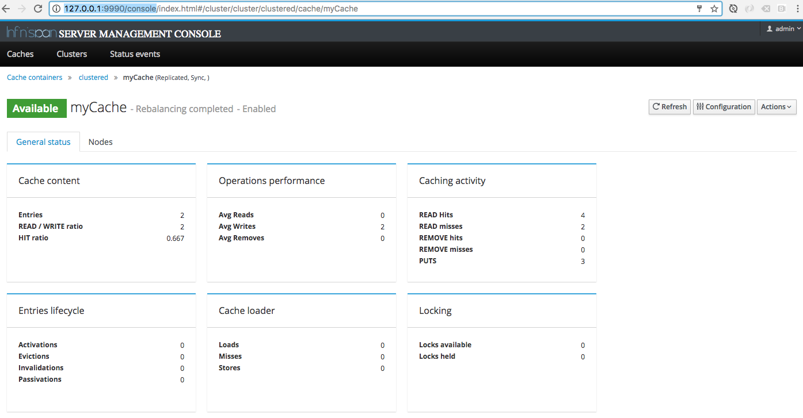

Chapter 17 - cluster-jcache
---------------------------

This directory holds an example how to use Infinispan as clustered distributed cache.
The Camel application is using the JCache component and the JCache API to access the cache. 

### 17.5.2 Clustering cache using JCache and Infinispan

#### Running Infinispan

You need to run an Infinispan Server which you can download from (chose Server)

    http://infinispan.org/download/
    
And then unzip Infinispan
     
    unzip infinispan-server-9.0.1.Final-bin.zip

Then we need to create an user

    cd infinispan-server-9.0.1.Final-bin
    ./bin/add-user.sh          (Windows users run the .bar file instead of .sh)               
    
.. create the user as administrator such as with `admin` as username and `admin` as password    

Then start Infinispan in domain mode 

    bin/domain.sh      (Windows users run the .bar file instead of .sh)
   
And then login to the web console at
   
    http://127.0.0.1:9990/console

In the web console you need to add a new cache with the name `myCache`. As a type you can choose `replicated`.

#### Running the Camel servers

The example requires to run at two JVMs concurrently by starting each Maven goal from each terminal:

    mvn compile exec:java -Pfoo
    mvn compile exec:java -Pbar

From another shell you can call either the foo or the bar JVMs from a web browser with

To call the Foo server:

    http://localhost:8888   

To call the Bar server:

    http://localhost:8889

You should then be able to receive a response with a increasing counter that is distributed. So if you
mix the calls between the two JVMs then the counter is correct increased by one each time.

For example if we call the Foo route 4 times and then Bar route 3 times, and Foo route 2 times again, 
we can see from the logs of the two JVMs they output representative:

```
Foo: counter is now 1
Foo: counter is now 2
Foo: counter is now 3
Foo: counter is now 4
Foo: counter is now 8
Foo: counter is now 9

Bar: counter is now 5
Bar: counter is now 6
Bar: counter is now 7
```

You can try to restart either Foo or Bar which should ensure the counter survives in the cache and is updated correctly.

From the Infinispan web console you should be able to see cache statistics as shown in the screenshot below:


