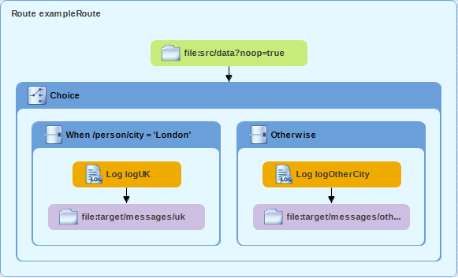

Chapter19 - JBoss Fuse Tooling
------------------------------

### 19.1.1 JBoss Fuse Tooling

This is a Camel example used to demonstrate the JBoss Fuse Tooling that has Camel editing and debugging capabilities, which you can run from Eclipse.

The tooling is open source and free to use.

You can find the source code of the tooling at github: https://github.com/jbosstools/jbosstools-fuse

#### Installing JBoss Fuse Tooling

##### Installing JBoss Fuse Tooling in existing Eclipse installation

You need to use Eclipse Oxygen 4.7

From Eclipse you choose `Help` -> `Eclipse Marketplace...`
  and then type `Camel` in the find field and press the Go button. 

In the selection list search select `Red Hat JBoss Developer Studio` which is the 
name chosen for the Camel and integration tools as part of the Red Hat JBoss Fuse product.

Then click `Install` on the selected and prepare for it to download and install a bunch of stuff which can take some time.

If the editor does not seem to be installing, then mind that its known to happen that a license agreement confirmation
box may show up below the window so you have to move the windows to find it.

After you restart Eclipse you're ready to go!

##### Installing JBoss Fuse Tooling from installer with Runtimes

If you are based on Windows or Mac OS, the easiest way to install Fuse Tooling is to use the [Red Hat Development Suite installer](https://developers.redhat.com/products/devsuite/overview/). It allows to install different Fuse Tooling and possible deployment Runtimes in few clicks (JBoss Fuse Karaf, JBoss EAP with Camel pre-installed, local OpenShift). See steps [here](https://developers.redhat.com/blog/2017/10/10/fuse-development-environment-development-suite-installer/).

##### Installing JBoss Fuse Tooling from installer without Runtimes

There is also an [installer just for Development Studio containing Jboss Fuse Tooling](https://developers.redhat.com/products/devstudio/download/). Runtimes can then be used/downloaded/configured when needed.
   
    
#### Using the editor

Open the `camel-context.xml` XML file which has the Camel route. The Camel route will be displayed graphically:

You can now use the graphical drag'n'drop editor to edit the EIP patterns.
The editor is 2-way editor, so you can always edit the XML source directly, and switch over
to the graphical editor, and continue editing. There is no lock-in.

#### Going further

The tooling is providing several features:
- Graphical Route Editor (as seen in previous paragraph)
- Graphical Data Mapper
- Integrated debugger: debugging can be done on the graphical editor and in the Java code
- Monitoring by connecting to the JMX Camel MBean
- Deployment on different Runtimes: facilities to deploy locally, on Karaf/FUSE, on Wildfly/JBoss EAP and on OpenShift.

For more details and stay up-to-date, see:
- [The community presentation page](http://tools.jboss.org/features/fusetools.html)
- [Getting started maintained by Red Hat](https://developers.redhat.com/products/fuse/hello-world/)
- [Fuse Tooling blog](https://developers.redhat.com/blog/tag/fuse-tooling/)
- Twitter account [@FuseTooling](https://twitter.com/fusetooling)

