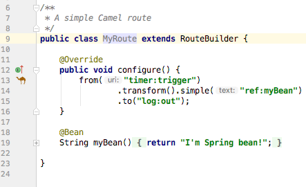
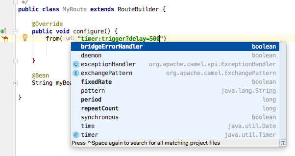

Chapter19 - Camel IDEA editor
-----------------------------

### 19.1.2 Camel IDEA plugin

This is a Camel example used to demonstrate the Apache Camel IDEA plugin,
which you can install as a plugin to IntelliJ IDEA.

#### Installing Apache Camel IDEA

From IDEA open `Preference` -> `Plugins` -> `Browse Repositories` and then type `Camel` in the search field to
find the `Apache Camel IDEA Plugin` plugin, which you can then install.

IDEA likely require to be restarted after installing the plugin.

When IDEA is loaded again, the Camel plugin should automatic be active when you have
loaded a project that uses Camel.

If you open the Camel route source code, eg the `MyRoute` class, then you should notice that
IDEA shows a Camel icon in the gutter where the route begins.

#### Using the Camel IDEA plugin

Open the Java file `MyRoute` and position the cursor at the end of the Camel endpoint at

    from("timer:trigger?delay=500")
    
eg at
    
    from("timer:trigger?delay=500<CURSOR HERE>")
        
Then press `ctrl` + `space` to active code completion. This will show a popup with a list of possible
endpoint options you can configure.

This works in similar fashion as you are editing Java source code and use `ctrl` + `space` for showing a list
of possible methods you can call on a Java instance etc.

And you can press `ctrl + j` to show quick documentation on the endpoint, or while browsing the list of options.
