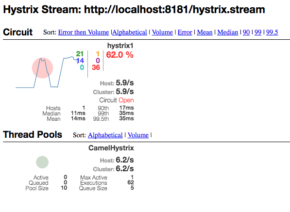

chapter7-prototype2-rules-springboot-hystrixdashboard
-----------------------------------------------------

## 7.4.10 The Hystrix Dashboard

Rules Engine microservice.

This service is simulating a rules engine used by the recommendation service to rank
and filter which items to recommend to users whom are shopping the Rider Auto Parts website.

This example is using Spring Boot instead of WildFly Swarm as the original rules service.

This time we have enabled support for Hystrix Dashboard which can be streamed from the following url:

    http://localhost:8181/hystrix.stream

### How to run

You need to download and run the Hystrix Dashboard from:

  https://bintray.com/kennedyoliveira/maven/standalone-hystrix-dashboard/1.5.6
   
Which is a standalone JAR file you run with:
   
    java -jar standalone-hystrix-dashboard-1.5.6-all.jar
   
And then open web browser on:
   
    http://localhost:7979/hystrix-dashboard/
   
And in the UI you type in:
   
    http://localhost:8181/hystrix.stream
      
And click the `Add stream` button. 

Then button `Monitor Streams` takes you to the Hystrix Dashboard where you should see the Hystrix EIP
       which are used by the Camel route to call the downstream inventory service.
       
Then start the inventory service in a separate shell
       
       cd chapter7/prototype2/inventory2
       mvn compile exec:java
       
Then from another shell start this application

      mvn spring-boot:run 

Then you can run the little script to put some load on the system
       
       ./hitme.sh
       
And then you can look at the Hystrix Dashboard, and then try to stop and start the inventory service
       to trigger failures and see how the circuit breaker behaves accordingly.

